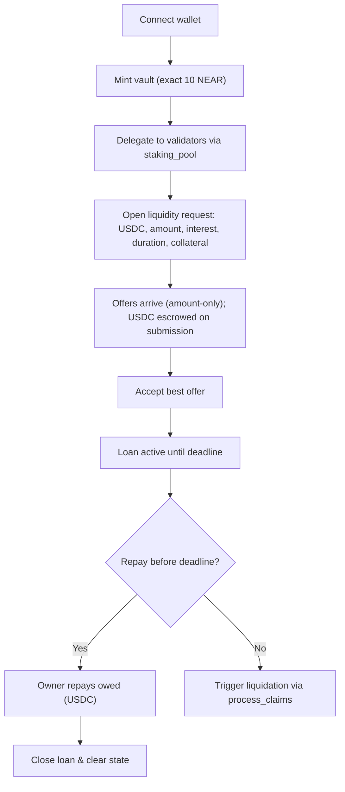
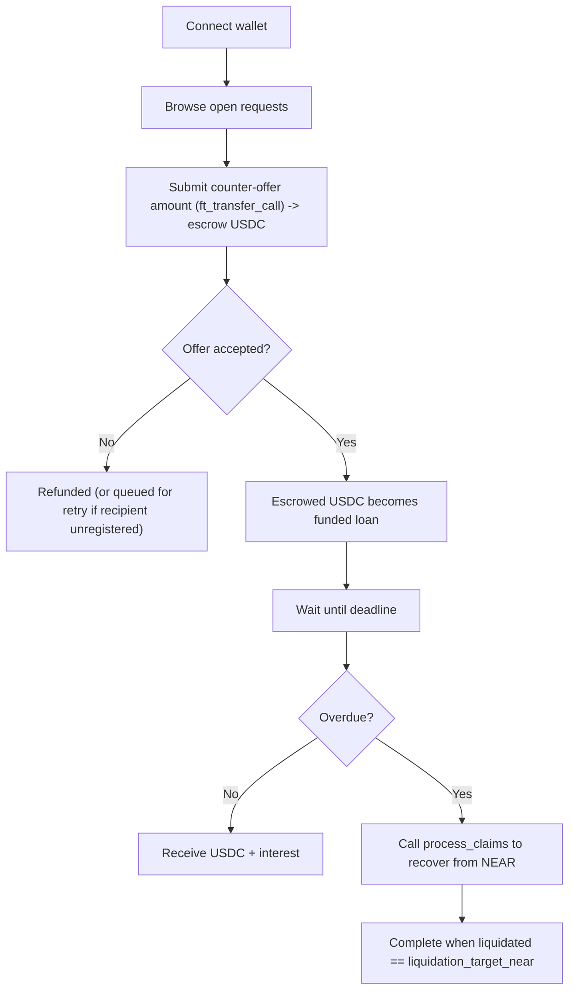
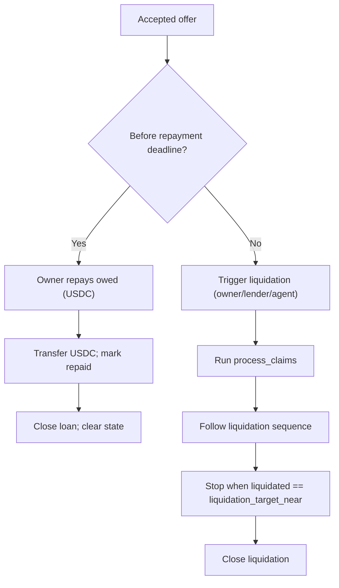
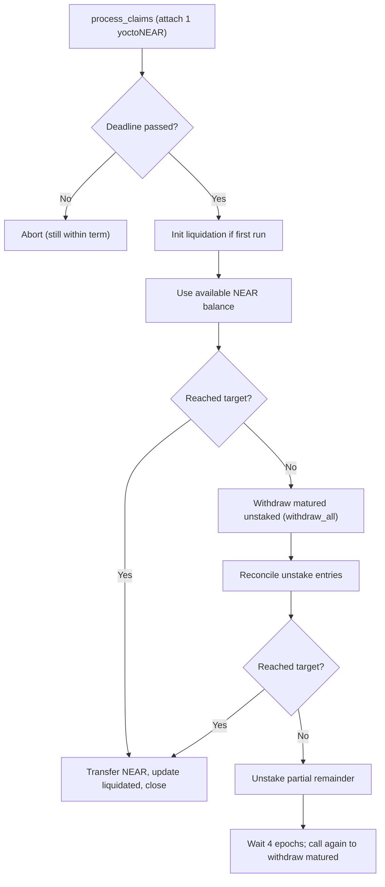
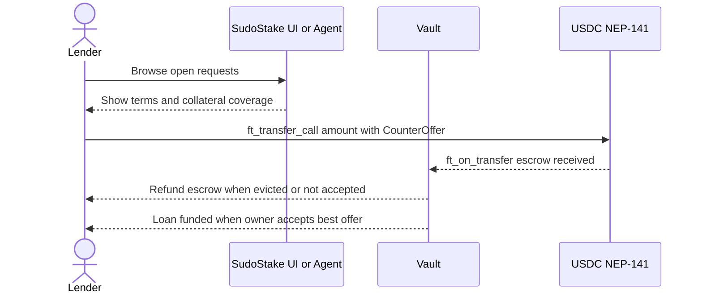
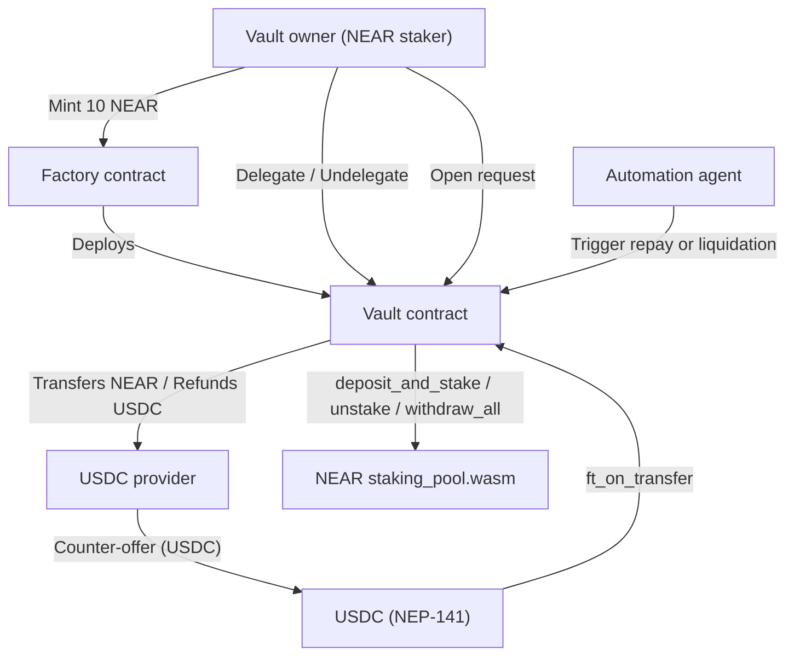

# SudoStake — Personas & Flows (NEAR MVP)

**Overview**

- Original date: 2025-08-20
- Context: NEAR MVP
- Summary: Non-custodial vaults with oracle-less logic. Actions can be executed manually or by an agent. USDC (NEP-141) provides liquidity. Staked NEAR is the collateral. No loan fees. Vault creation fee is exactly **10 NEAR**.

**Key terms**

- **owed (USDC):** Principal plus agreed interest to repay before the deadline.
- **liquidation_target_near (NEAR):** Maximum NEAR that may be transferred to the lender during default recovery.
- **liquidated (NEAR):** Total NEAR transferred so far in the liquidation process.

---

## At a glance

- **What:** Borrow USDC against staked NEAR via non-custodial, oracle-less vaults.
- **Who:** NEAR stakers (owners) and USDC lenders.
- **How:** Open a request -> accept best offer -> repay USDC by deadline **or** anyone runs deterministic liquidation.
- **Defaults:** Vault mint fee **10 NEAR**; offers are **amount-only**; the vault keeps only the **best 10** offers at any time. When a new, better offer arrives, the lowest-ranked offer is removed and its escrowed USDC is refunded (or recorded for retry if refund fails); unstake unlock in **4 epochs**; rewards auto-restake.
- **Triggers:** Owner, lender, or automation agent can execute key actions. No price oracles.
- **Fees:** Zero loan fees (network/storage fees still apply).

---

## Table of contents

1. [Purpose & scope](#purpose--scope)
2. [At a glance](#at-a-glance)
3. [System rules (MVP)](#system-rules-mvp)
4. [Personas](#personas)
   - [Vault owner (NEAR staker)](#vault-owner-near-staker)
   - [Lender (USDC provider)](#lender-usdc-provider)
5. [User needs](#user-needs)
6. [Key entities & states](#key-entities--states)
7. [Core user flows](#core-user-flows)
   - [Owner journey: vault -> loan](#owner-journey--vault--loan)
   - [Lender journey: offer -> outcome](#lender-journey--offer--outcome)
8. [Control flow](#control-flow)
   - [Lifecycle: repay vs liquidate](#lifecycle-repay-vs-liquidate)
   - [Executor: `process_claims`](#executor-process_claims)
9. [Lender discovery & offer (sequence)](#lender-discovery--offer-sequence)
10. [System context diagram](#system-context-diagram)
11. [UI state model](#ui-state-model)
12. [Edge cases & recovery](#edge-cases--recovery)
13. [KPIs](#kpis)

---

## Purpose & scope

This document summarizes (a) **user personas** and (b) **system/user flows** for SudoStake’s **NEAR MVP**. It is meant for product, protocol, and integration reviews.

---

## System rules (MVP)

- **Self-custody:** Vaults are **non-upgradable**, **keyless** contracts that track owner **in state**; minted via Factory for **exact 10 NEAR**.
- **Delegation only via** NEAR `staking_pool.wasm`; rewards auto-restake.
- **Liquidity request** fields: `{ token: USDC, amount, interest, duration, collateral: staked NEAR }`.
- **Counter-offers:** amount-only; funds escrowed via `ft_transfer_call`. The vault maintains only the **best 10** offers at any moment. If a new, better offer arrives, it evicts the lowest-ranked offer and refunds its escrowed USDC (or adds a retry entry if refund fails).
- **Acceptance:** best offer locked; all others refunded.
- **Repayment:** owner repays **owed (USDC)** before deadline.
- **Default & liquidation:** once `accepted_at + duration` elapses, **anyone** may run recovery in order: **(1)** use available NEAR; **(2)** withdraw matured unstaked; **(3)** fallback to unstake the remainder; stop when `liquidated == liquidation_target_near`.
- **Fees:** Zero protocol fees on loan activities.

---

## Personas

### Vault owner (NEAR staker)

**Profile:** Self-custody NEAR holder, comfortable with wallets and validator selection.  
**Goals:** Keep staking yield; unlock USDC quickly; clear deadlines; preserve validator autonomy; minimize fees.

**Key actions**

- Mint vault (exact **10 NEAR**).
- Delegate/undelegate via `staking_pool.wasm` (auto-restake).
- Open request (USDC amount, interest, duration, collateral).
- Review **amount-only** offers (escrowed), accept best; repay on time or allow liquidation.

**Decisions**

- Pick duration to match cash flow.
- Ensure **total staked ≥ collateral**.
- Choose reliable validators; avoid idle unstaked balances.

**Risks**

- Validator performance/slashing.
- Missed deadlines (mitigate with automation).

**Owner metrics**

- Time to mint.
- Time request -> acceptance.
- On-time repay rate.
- Liquidation incidence.

---

### Lender (USDC provider)

**Profile:** USDC holder seeking deterministic, rules-based yield backed by staked NEAR.  
**Goals:** Predictable APR; transparent recovery on default; low operational overhead.

**Key actions**

- Browse requests; submit **amount-only** counter-offer via `ft_transfer_call` (escrow).
- If accepted, escrow becomes loan; non-winners refunded (or queued for retry).
- Before deadline: expect **USDC + interest**. After deadline: call `process_claims` to recover from NEAR.

**Decisions**

- Check collateral coverage, duration, rate; size exposure.

**Risks**

- Temporarily stuck funds (mitigated by self-triggered recovery).
- Oracle risk (none; rules-based).

**Lender metrics**

- Fill rate.
- Realized vs quoted APR.
- Default recovery time.
- Principal recovery rate.

---

## User needs

- **As a staker,** borrow USDC against staked NEAR **without leaving self-custody**, keeping validator choice and yield.
- **As a lender,** rely on **rules-based recovery** on default, no oracles, to assess risk deterministically.
- **As the deadline approaches,** use **automation or one-click actions** to repay or recover.

---

## Key entities & states

| Component | Purpose | Key methods / state |
|---|---|---|
| **Factory contract** | Mints keyless, non-upgradable vaults; enforces exact **10 NEAR** mint fee | `mint_vault`, `withdraw_balance`, `get_contract_state` |
| **Vault contract** | Delegation, requests/offers, repayments, liquidation, refund retries | `delegate`, `undelegate`, `request_liquidity`, `accept_best_offer`, `process_claims`, `cancel_liquidity_request` |
| **Validators (`staking_pool.wasm`)** | Native staking ops; auto-restake rewards; 4-epoch unlock | `deposit_and_stake`, `unstake`, `withdraw_all`, `get_account` |
| **USDC (NEP-141)** | Loan/offer escrow and refunds | `ft_transfer_call`, `ft_transfer` |
| **State fields** | Track offers, accepted offer, unstake entries, refunds, liquidation progress | `counter_offers (top-10)`, `accepted_offer`, `unstake_entries`, `retry_entries`, `liquidated` |

---

## Core user flows

### Owner journey — vault -> loan

### Lender journey — offer -> outcome

---

## Control flow

### Lifecycle: repay vs liquidate

### Executor: `process_claims`

---

## Lender discovery & offer (sequence)

---

## System context diagram

---

## UI state model

| State | Meaning | Primary actions |
|---|---|---|
| **Active** | Vault exists; no open request | Delegate/undelegate; open request |
| **Request Open** | Accepting amount-only offers | Accept best; cancel request |
| **Accepted** | Loan active; countdown until deadline | Repay `owed (USDC)` |
| **Repaid** | Loan closed; state cleared | — |
| **Liquidation Active** | Deadline passed; deterministic recovery in progress | Run `process_claims` until `liquidated == liquidation_target_near` |
| **Closed** | No active loan; normal vault ops | Delegate/undelegate; open new request |

---

## Edge cases & recovery

- **Failed USDC refunds:** append to `retry_entries`; allow retries by owner/proposer; emit logs.
- **Typical refund failures:** recipient unregistered or lacks storage deposit on USDC token.
- **Storage/gas safety:** enforce storage buffer (e.g., **0.01 NEAR**) and fixed gas in integration paths.
- **Validator stake = 0:** prune from active set during checks.
- **Over-unstake attempts:** rely on `staking_pool` errors; vault surfaces failure cleanly.
- **Takeover (future):** allowed only when no active validators and no pending unstake entries; blocks new delegations while listed.

---

## KPIs

| Track | Metrics |
|---|---|
| **Owner** | median mint time; request->accept time; on-time repay rate; % with clear validator sets |
| **Lender** | fill rate; realized vs quoted APR; median liquidation duration; principal recovery rate |
| **System** | failed refund rate; automation coverage; revert rate per method |
