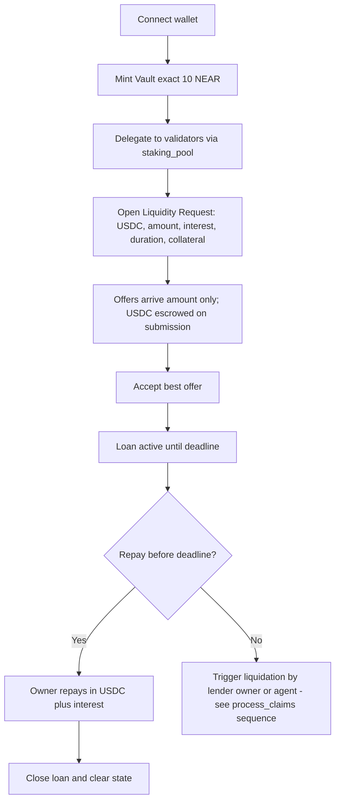
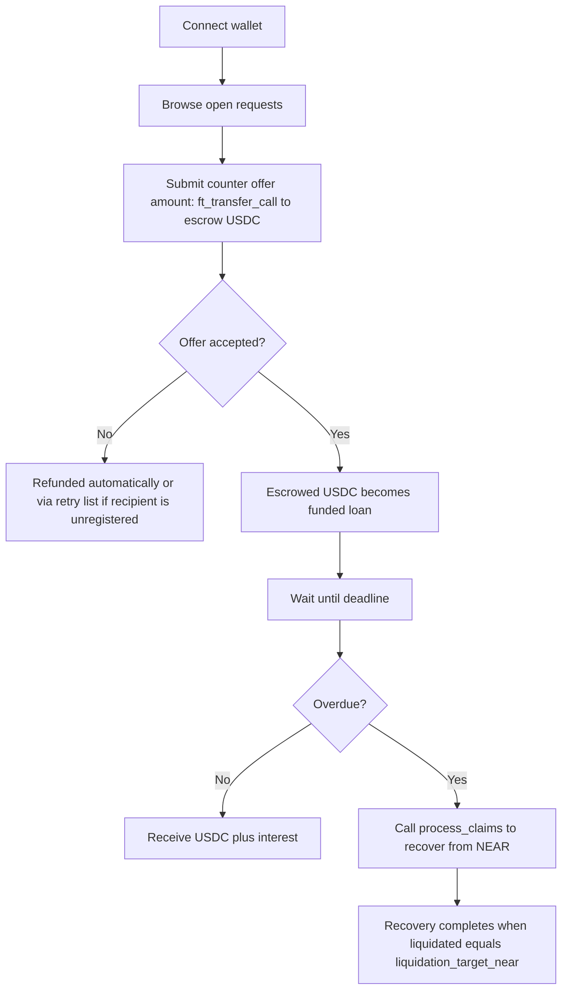
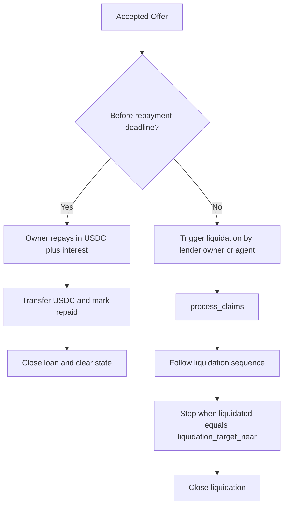
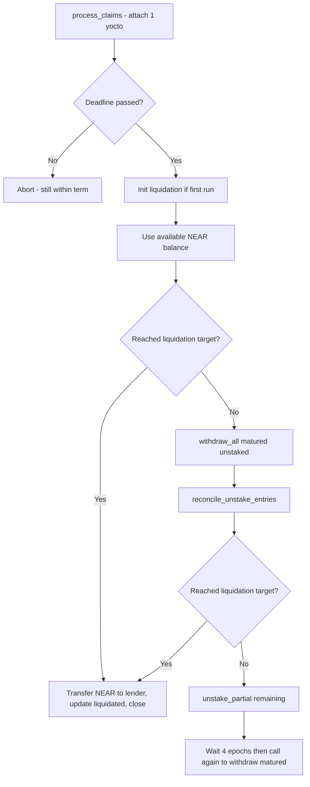
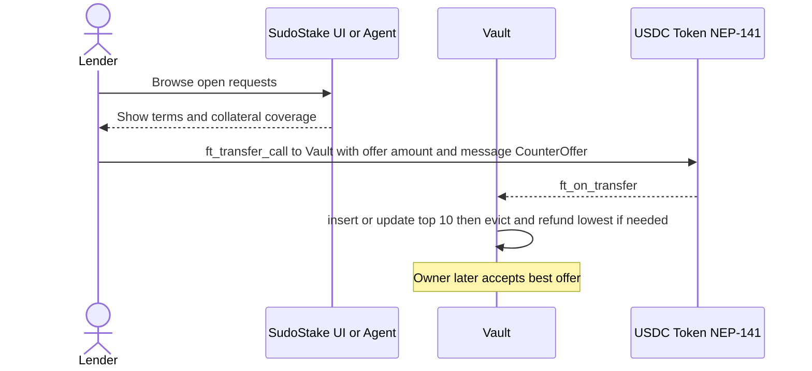
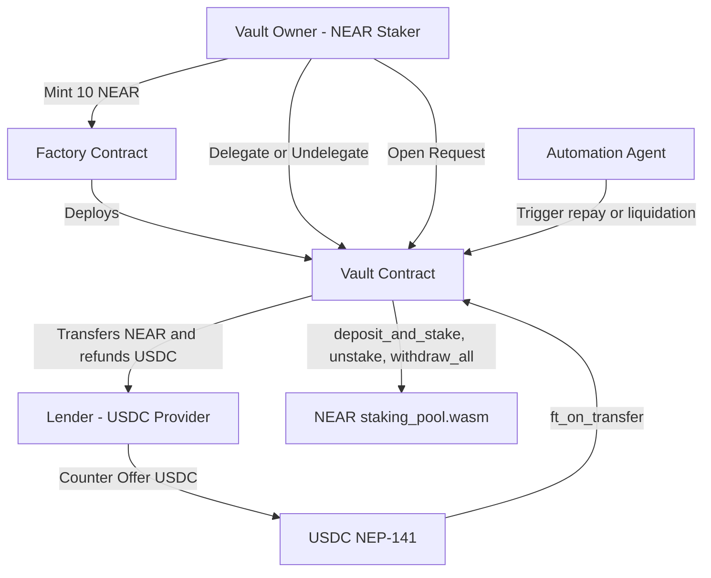

# SudoStake — User Personas & Flow Diagrams (NEAR MVP)

**Date:** Aug 20, 2025  
**Scope:** NEAR Protocol MVP. Non-custodial vaults, oracle-less design, manual/agent-triggered actions, USDC (NEP-141) liquidity, staked NEAR as collateral, zero protocol loan fees, 10 NEAR vault creation fee.

---

## 1) Purpose & Scope
This document provides (a) concise user personas and (b) system/user flow diagrams for SudoStake’s NEAR MVP. **Definition:** *owed (USDC)* = principal + interest; *liquidation_target_near (NearToken)* = cap for NEAR payout on default.

**Key points:**
- **Self-custody, always.**
- **No oracles. Just rules.**
- **USDC in; NEAR on default.**
- **Exact mint fee: 10 NEAR.**
- **Manual or agent-triggered actions.**

It reflects the current rules:
- Vaults are **non-upgradable**, **keyless contracts** that **track an owner in state**, minted via a Factory (exact **10 NEAR** fee).  
- Delegation via NEAR `staking_pool.wasm` only; rewards auto-restake.  
- Liquidity requests specify token (USDC), amount, interest, duration, collateral (staked NEAR).  
- Lenders submit counter-offers that **only change amount**; funds are **escrowed on submission**; on acceptance, the best is locked and all others are refunded.  
- Repayment must occur before the deadline or liquidation becomes available (manual/agent trigger).  
- Liquidation sequence: available NEAR -> matured unstaked -> fallback unstake from validators; stop when `liquidated` (NearToken) equals `liquidation_target_near`.  
- Zero protocol fees on loan activities.

---

## 2) Personas

### Vault Owner (NEAR Staker)

**Keep yield. Get cash. Your validator, your rules.**

**Profile:** Self-custody NEAR holder; comfortable with wallets and validator choice.  
**Goals:** Keep staking rewards; unlock USDC quickly; clear deadlines; minimal fees; maintain validator autonomy.

**Key actions**
- Mint vault (exact **10 NEAR**).
- Delegate/undelegate via `staking_pool.wasm` (rewards auto-restake).
- Open request: USDC, amount, interest, duration, collateral.
- Review amount-only offers (escrowed), accept best; repay on time or let liquidation run.

**Decisions**
- Choose duration to match cash flow.
- Ensure total staked >= collateral.
- Prefer reliable validators; avoid idle unstaked balances.

**Risks and considerations**
- Validator performance/slashing; missing deadlines (can use automation/agents).

**Metrics**
- Time to mint; request->accept time; on-time repay rate; liquidation incidence.

---

### Lender (USDC Provider)

**Yield with a backstop. Deterministic recovery. Zero protocol loan fees.**

**Profile:** USDC holder seeking deterministic, rules-based yield backed by staked NEAR.  
**Goals:** Earn predictable APR; deterministic recovery on default; low overhead.

**Key actions**
- Browse requests; submit amount-only counter-offer via `ft_transfer_call` (escrow).
- If accepted: escrow becomes loan; non-winners refunded (retry list handles failures).
- Before deadline: expect USDC plus interest. If overdue: call process_claims (liquid -> matured -> fallback unstake).

**Decisions**
- Check collateral coverage, duration, and rate; size offer for exposure.

**Risks and considerations**
- Stuck funds (mitigated by self-triggered recovery), hidden fees (none on loans), oracle risk (none).

**Metrics**
- Fill rate; realized vs quoted APR; default recovery time; principal recovery rate.

## 3) User Needs
- **When I’ve staked NEAR but need stable liquidity,** I want to borrow USDC against my staked position **without leaving self-custody**, so I maintain yield and validator choice.  
- **When I provide USDC liquidity,** I want **rules-based recovery** of my funds on default, without price oracles, so I can assess risk deterministically.  
- **When a loan nears its deadline,** I want **automations or one-click actions** to either repay or recover, so I don’t babysit positions.

---

## 4) Key Entities & States
- **Factory Contract:** mints non-upgradable, keyless vaults that track an owner in state; enforces 10 NEAR fee; deploys the vault code.  
- **Vault Contract:** delegates/undelegates, tracks unstake entries per validator, manages liquidity request, accepted offer, liquidation progress, refund retries.  
- **Validators — staking_pool.wasm:** handle deposit_and_stake, unstake, withdraw_all; rewards auto-restake.  
- **Liquidity Request:** {token: USDC, amount, interest, duration, collateral (staked NEAR)}  
- **Counter-Offers in USDC:** top-10, amount-only changes; evictions refunded.  
- **Accepted Offer:** records lender, amount, interest, duration. Expected repayment is USDC plus interest. On default, the lender is repaid in **NEAR** via liquidation. **Owed (USDC) = principal + agreed interest.** Internally, `liquidated` (NearToken) tracks cumulative NEAR paid to control liquidation progress. It also records `liquidation_target_near` (NearToken), the NEAR cap used during default recovery.
- **Liquidation:** kicks in after accepted_at + duration; sequence: available NEAR -> matured unstaked -> fallback unstake; stop when `liquidated` (NearToken) reaches `liquidation_target_near`.

---

## 5) Flow Diagrams

### A) Owner Journey — From Vault to Loan

### B) Lender Journey — Offer to Outcome

---

## 6) Control Flow

*Legend:* **owed (USDC)** = principal + interest; **liquidation_target_near (NEAR)** = cap for default payouts; **liquidated (NEAR)** tracks progress.

### A) Loan Lifecycle — Repay vs Liquidate

### B) Liquidation Executor — process_claims Control Flow

---

## 7) Lender Discovery & Offer Flow (Sequence)

---

## 8) System Context Diagram

---

## 9) UI State Model
*What users see:*
- **Vault States:** Uninitialized -> Active (no request) -> Request Open (offers incoming) -> Accepted (countdown running) -> **Repaid** or **Liquidation Active** -> **Closed**.  
- **Per-Validator Status:** staked, unstaked (maturing), withdrawable, last epoch seen.
  - Withdrawable after epoch X (countdown).  
- **Offer Board:** sorted by amount; shows evictions/refunds; accepted marker.  
- **Liquidation Progress:** liquidated so far, remaining due, source breakdown (liquid/matured/fallback), next action CTA.

---

## 10) Edge Cases & Recovery
- **Failed USDC refunds:** add to `retry_entries`; allow retries by owner/proposer; log events.
- **Retry entries typically arise when:** the USDC recipient is unregistered or lacks storage deposit.
- **Insufficient storage / gas:** enforce storage buffer (e.g., 0.01 NEAR) and fixed gas in integration paths.  
- **Validator stake == 0:** prune from active set during checks.  
- **Over-unstake attempts:** rely on staking_pool contract errors; vault surfaces failure cleanly.  
- **Takeover flow (future):** only when no active validators and no pending unstake entries; blocks new delegations while listed.

---

## 11) KPIs
- **Owner:** median time to mint vault; time from request open -> accepted; on-time repay rate; % with clear validator set.  
- **Lender:** fill rate; average liquidation duration; realized vs quoted APR; % funds recovered in default.  
- **System:** failed refund rate; automation coverage; revert rate per method.

---

## 12) Deliverables Checklist
- ✅ Primary personas (Owner, Lender) with goals, tasks, objections, metrics.  
- ✅ Core flows (create/delegate; request/counter-offer; fund/repay/liquidate).  
- ✅ Mermaid diagrams: user journeys and control-flow blocks.  
- ✅ Edge cases, UI states, and KPIs aligned to NEAR MVP rules.
