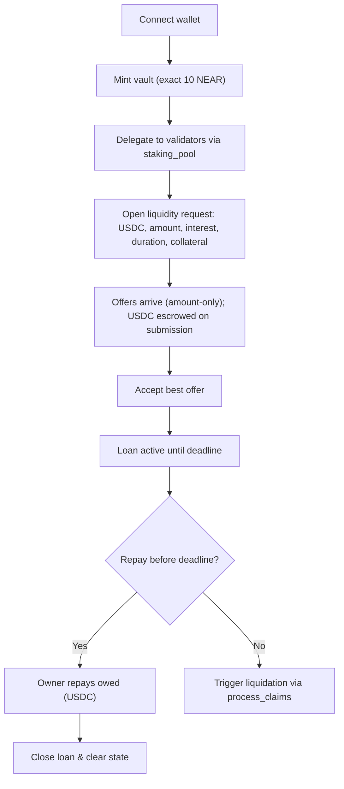
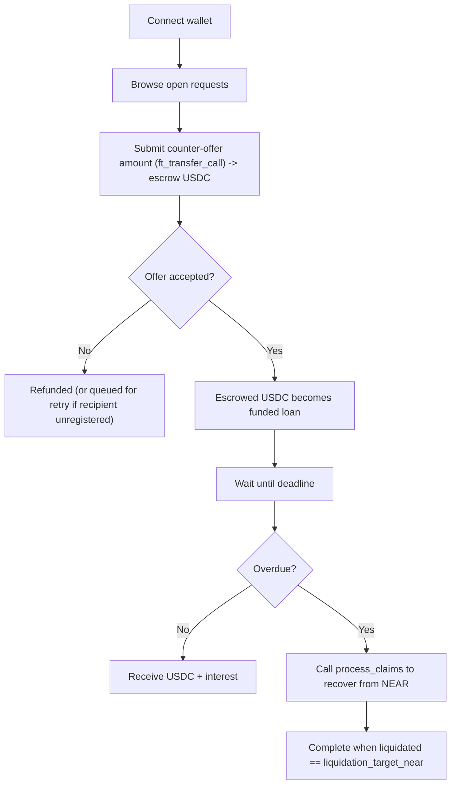
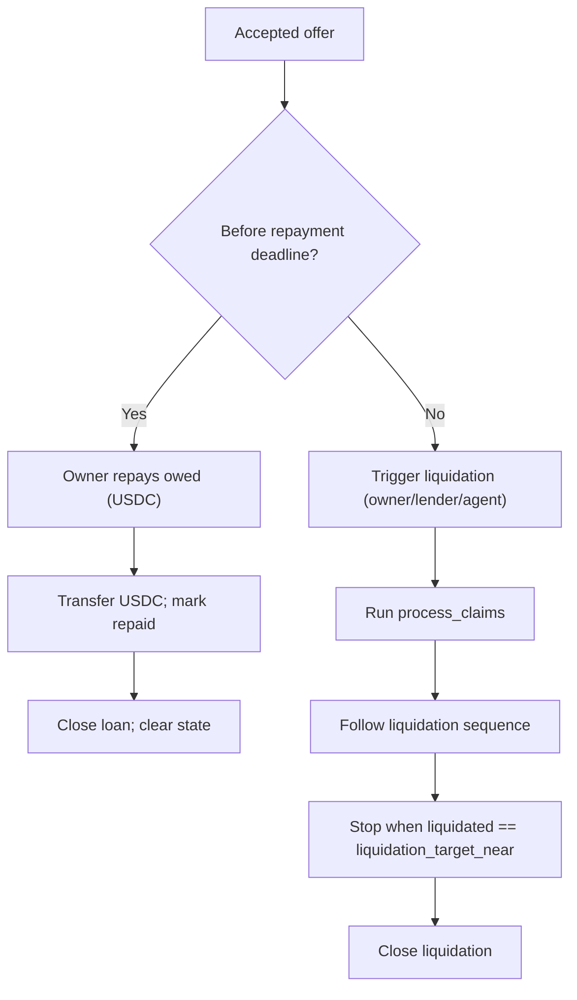
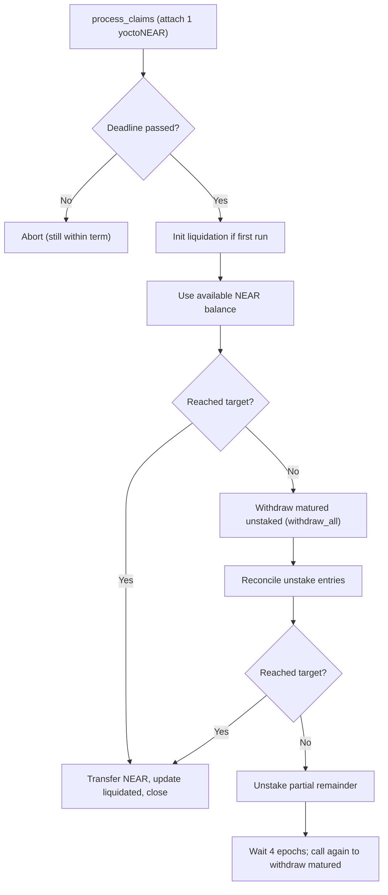
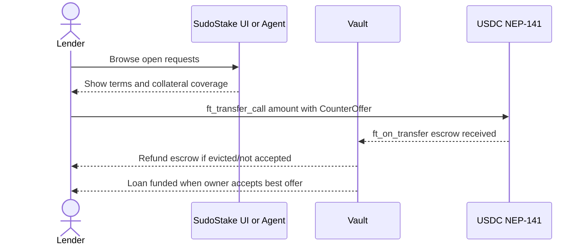
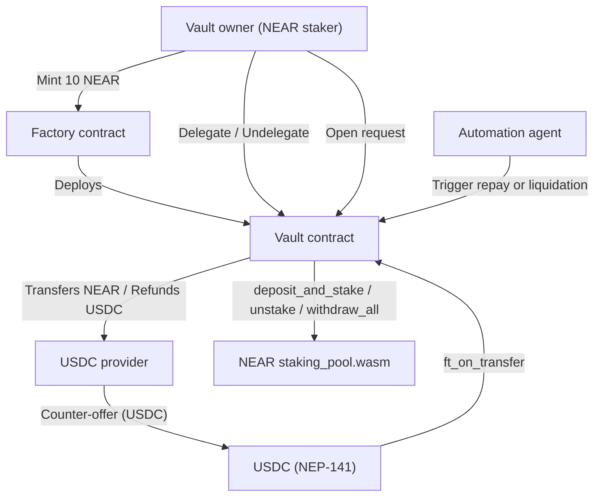

# SudoStake — Personas & Flows (NEAR MVP)

## TL;DR
- **Context:** NEAR MVP as of 2025-08-20.
- **Summary:** Non-custodial, oracle-less vaults with manual or agent execution. USDC (NEP-141) liquidity, staked NEAR collateral, no loan fees, 10 NEAR vault mint fee.

## Key Terms
- **owed (USDC):** principal + interest due before deadline.
- **liquidation_target_near (NEAR):** maximum NEAR transferable during recovery.
- **liquidated (NEAR):** NEAR delivered so far during liquidation.

---

## At a glance
- What: Borrow USDC against staked NEAR via non‑custodial, oracle‑less vaults.
- Who: NEAR stakers (owners) and USDC lenders.
- How: Open request → accept best offer → repay by deadline or anyone runs deterministic liquidation.
- Defaults: Vault mint fee 10 NEAR; offers amount‑only; keep top‑10 offers with eviction + refund (or retry log); unstake unlock in 4 epochs; rewards auto‑restake.
- Triggers: Owner, lender, or agent can execute; no price oracles.
- Fees: Zero loan fees (network/storage fees still apply).

---

## Contents
1) Purpose & scope
2) At a glance
3) System rules (MVP)
4) Personas (Owner, Lender)
5) User needs
6) Entities & states
7) Core user flows
8) Control flow (repay vs liquidate; process_claims)
9) Lender discovery & offer (sequence)
10) System context diagram
11) UI state model
12) Edge cases & recovery
13) KPIs

---

## Purpose & scope

This document summarizes (a) **user personas** and (b) **system/user flows** for SudoStake’s **NEAR MVP**. It is meant for product, protocol, and integration reviews.

---

## System rules (MVP)
- Self‑custody: non‑upgradable, keyless vaults; owner stored in state; mint via Factory for 10 NEAR.
- Delegation via NEAR `staking_pool.wasm`; rewards auto‑restake.
- Liquidity request: { token: USDC, amount, interest, duration, collateral: staked NEAR }.
- Counter-offers: amount-only; escrow via `ft_transfer_call`; keep top-10; evict lowest with refund or retry log.
- Acceptance: best offer locked; others refunded.
- Repayment: owner repays owed (USDC) before deadline.
- Default/liquidation: after `accepted_at + duration`, anyone may recover: liquid → matured‑unstaked → unstake remainder; stop at `liquidation_target_near`.
- Fees: zero protocol fees on loan activities.

---

## Personas

### Vault owner (NEAR staker)
Profile: Self‑custody NEAR holder; comfortable with wallets/validators.
Goals: Keep yield; unlock USDC; clear deadlines; preserve validator autonomy; minimize fees.
Key actions: Mint (10 NEAR); delegate/undelegate; open request (amount, interest, duration, collateral); review amount‑only offers; accept best; repay or allow liquidation.
Decisions: Duration fit; staked ≥ collateral; validator reliability; avoid idle balances.
Risks: Validator performance/slashing; missed deadlines (use automation).
Owner metrics: time to mint; request→accept; on‑time repay; liquidation incidence.

---

### Lender (USDC provider)
Profile: USDC holder seeking rules‑based yield backed by staked NEAR.
Goals: Predictable APR; transparent recovery; low overhead.
Key actions: Browse requests; submit amount‑only counter‑offer via `ft_transfer_call` (escrow); if accepted, escrow becomes loan; others refunded/queued; pre‑deadline expect USDC+interest; post‑deadline call `process_claims`.
Decisions: Collateral coverage, duration, rate, exposure sizing.
Risks: Temporarily stuck funds (self‑triggered recovery); oracle risk (none).
Lender metrics: fill rate; realized vs quoted APR; recovery time; principal recovery rate.

---

## User needs

- **As a staker,** borrow USDC against staked NEAR **without leaving self-custody**, keeping validator choice and yield.
- **As a lender,** rely on **rules-based recovery** on default, no oracles, to assess risk deterministically.
- **As the deadline approaches,** use **automation or one-click actions** to repay or recover.

---

## Key entities & states

| Component | Purpose | Key methods / state |
|---|---|---|
| **Factory contract** | Mints keyless, non-upgradable vaults; enforces exact **10 NEAR** mint fee | `mint_vault`, `withdraw_balance`, `get_contract_state` |
| **Vault contract** | Delegation, requests/offers, repayments, liquidation, refund retries | `delegate`, `undelegate`, `request_liquidity`, `accept_best_offer`, `process_claims`, `cancel_liquidity_request` |
| **Validators (`staking_pool.wasm`)** | Native staking ops; auto-restake rewards; 4-epoch unlock | `deposit_and_stake`, `unstake`, `withdraw_all`, `get_account` |
| **USDC (NEP-141)** | Loan/offer escrow and refunds | `ft_transfer_call`, `ft_transfer` |
| **State fields** | Track offers, accepted offer, unstake entries, refunds, liquidation progress | `counter_offers (top-10)`, `accepted_offer`, `unstake_entries`, `retry_entries`, `liquidated` |

---

## Core user flows

### Owner journey — vault -> loan

### Lender journey — offer -> outcome

---

## Control flow

### Lifecycle: repay vs liquidate

### Executor: `process_claims`

---

## Lender discovery & offer (sequence)

---

## System context diagram

---

## UI state model

| State | Meaning | Primary actions |
|---|---|---|
| **Active** | Vault exists; no open request | Delegate/undelegate; open request |
| **Request Open** | Accepting amount-only offers | Accept best; cancel request |
| **Accepted** | Loan active; countdown until deadline | Repay `owed (USDC)` |
| **Repaid** | Loan closed; state cleared | — |
| **Liquidation Active** | Deadline passed; deterministic recovery in progress | Run `process_claims` until `liquidated == liquidation_target_near` |
| **Closed** | No active loan; normal vault ops | Delegate/undelegate; open new request |

---

## Edge cases & recovery

- **Failed USDC refunds:** append to `retry_entries`; allow retries by owner/proposer; emit logs.
- **Typical refund failures:** recipient unregistered or lacks storage deposit on USDC token.
- **Storage/gas safety:** enforce storage buffer (e.g., **0.01 NEAR**) and fixed gas in integration paths.
- **Validator stake = 0:** prune from active set during checks.
- **Over-unstake attempts:** rely on `staking_pool` errors; vault surfaces failure cleanly.
- **Takeover (future):** allowed only when no active validators and no pending unstake entries; blocks new delegations while listed.

---

## KPIs

| Track | Metrics |
|---|---|
| **Owner** | median mint time; request->accept time; on-time repay rate; % with clear validator sets |
| **Lender** | fill rate; realized vs quoted APR; median liquidation duration; principal recovery rate |
| **System** | failed refund rate; automation coverage; revert rate per method |

## Related Documents
- [SudoStake Roadmap — NEAR MVP & Launch](../execution/sudostake-roadmap-near-mvp.md)
- [SudoStake Core Infra on NEAR](../systems/sudostake-core-infra-on-near.md)
- [Lean Canvas — SudoStake on NEAR](./lean-canvas-sudostake-near.md)

## Next Review
- Revisit after the 2025-10-15 risk register update or when user flows change materially.
